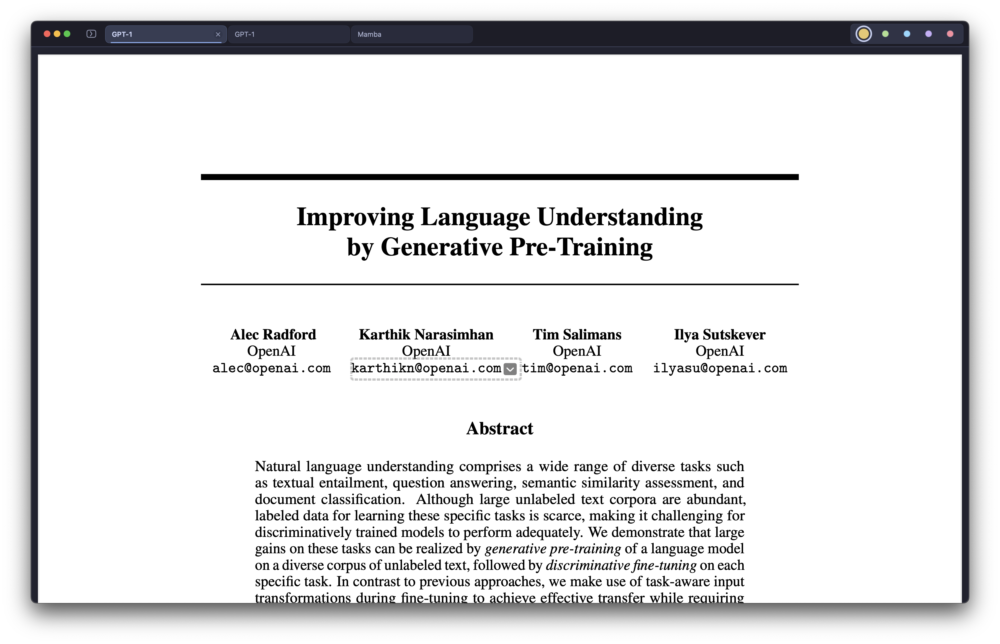
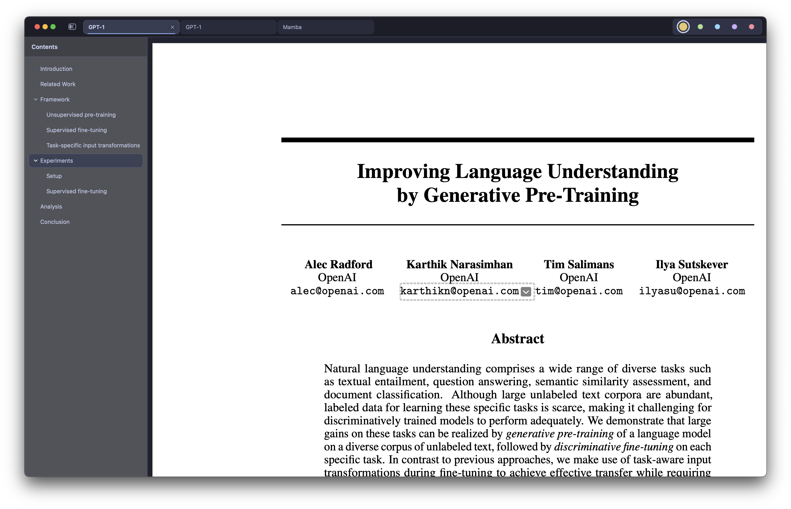
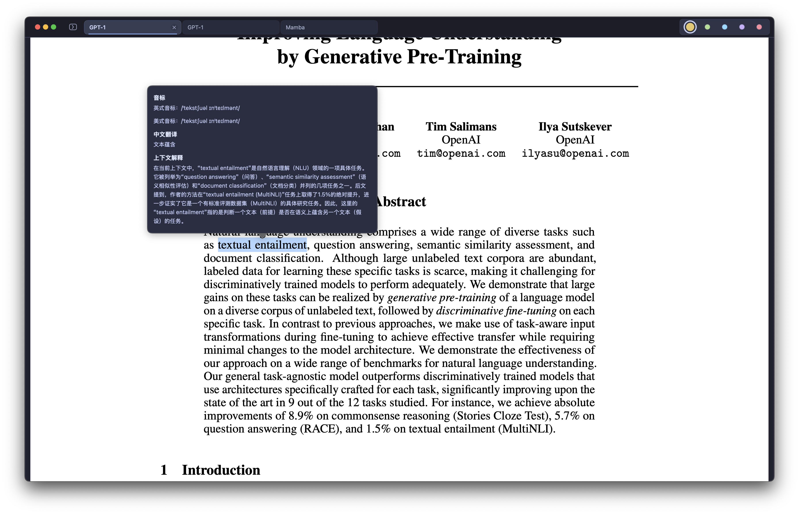

# Vellum

简体中文 | [English](README.md)

Vellum 是一款原生 macOS PDF 阅读器，围绕快速、键盘优先的阅读体验设计。它把 Vim 风格导航、轻量标签页、目录浏览、搜索、高亮和可选的 AI 解释整合在一起。

## 核心功能

- 使用 Vim 风格按键完成平滑滚动、翻页、跳转、缩放和标签页切换。
- 用键盘浏览 PDF 目录，并把目录跳转纳入前进/后退历史。
- 在 PDF 内搜索，跳转匹配结果，并把搜索结果转成可操作的文本选择。
- 对选中文本添加高亮、切换高亮颜色、复制文本、删除已有高亮。
- 使用 OpenAI 兼容模型解释选中文本或已保存的高亮内容。
- 同时打开多个 PDF，通过紧凑标签页管理阅读任务，并恢复最近关闭的 PDF。

## 快速开始

[下载最新版本](https://github.com/AbyssSkb/Vellum/releases/latest)，打开 DMG 后启动 Vellum。

打开 PDF 后，可以先记住这些常用按键：

| 按键 | 功能 |
| --- | --- |
| `o` / `O` | 在当前标签页打开 PDF / 在新标签页打开 PDF |
| `j` / `k` | 向下 / 向上滚动 |
| `d` / `u` | 大幅向下 / 向上滚动 |
| `D` / `U` | 超大幅向下 / 向上滚动 |
| `Space` / `f` / `b` | 向后 / 向前翻页 |
| `gg` / `G` / `[num]G` | 首页 / 末页 / 跳到指定页 |
| `/` / `n` / `N` | 搜索 / 下一个结果 / 上一个结果 |
| `Tab` / `t` | 显示或隐藏目录 |
| `m` / `y` / `a` | 高亮 / 复制 / 解释选中文本 |
| `=` / `-` / `0` / `z` | 放大 / 缩小 / 适合整页 / 适合宽度 |

## 使用文档

阅读完整文档：

- [中文使用文档](docs/USER_GUIDE.zh-CN.md)

## 反馈

如果使用中遇到任何问题，欢迎通过 [GitHub Issues](https://github.com/AbyssSkb/Vellum/issues) 向我反馈。

## 截图

## 系统要求

- macOS 14 或更新版本
- 可阅读的 PDF 文件
- 可选：用于 AI 解释功能的 OpenAI 兼容 API 服务

## 说明

Vellum 是一个通过 vibe coding 做出来的个人阅读器：靠品味、迭代，以及和 AI 一起把想法一点点推进成可用的软件。
