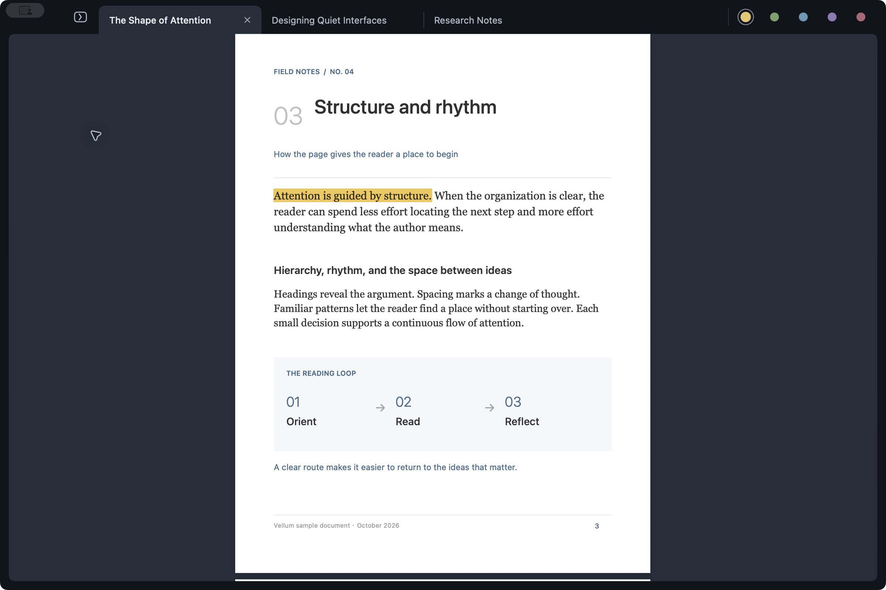
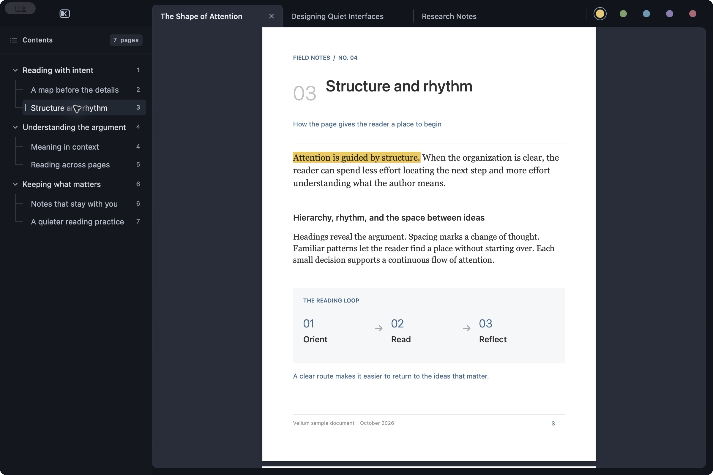
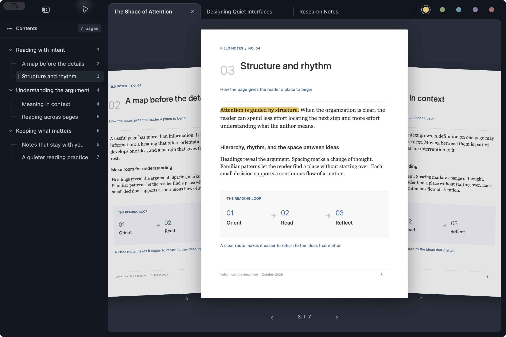
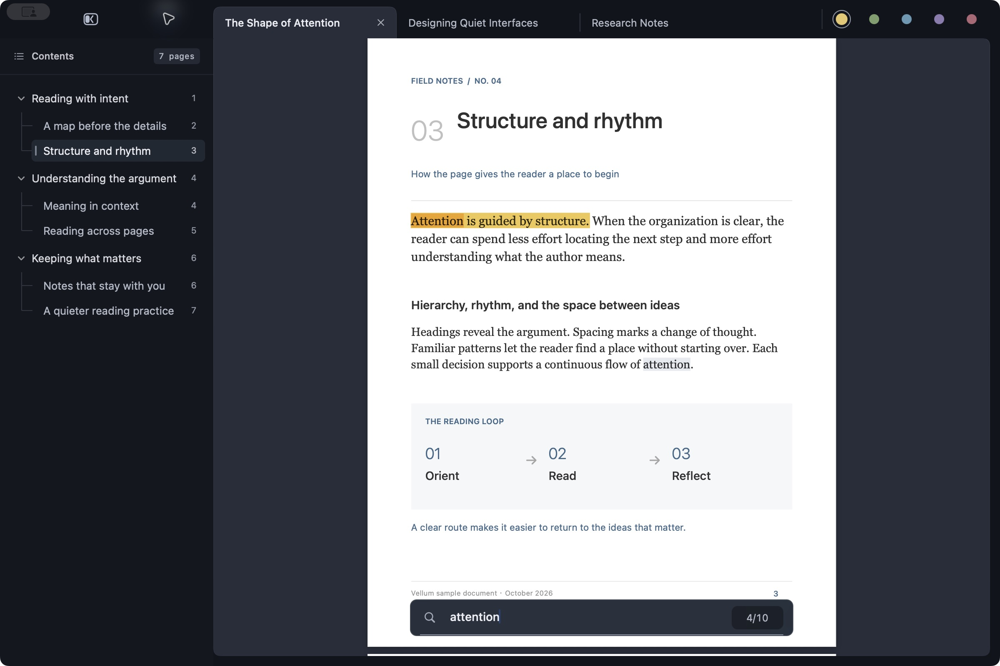

# Vellum User Guide

[简体中文](USER_GUIDE.zh-CN.md) | English · [README](../README.md)

Vellum is a native macOS PDF reader with keyboard navigation, an immersive page gallery, searchable tabs, outlines, and highlights. It requires macOS 14 or later and runs on Apple silicon and Intel Macs.

## Open files and manage tabs

Download the app from [GitHub Releases](https://github.com/AbyssSkb/Vellum/releases/latest), open the disk image, and drag Vellum to Applications. Launch it and open a PDF from the empty reader or the file picker.

`o` and `Command-O` follow **Settings → General → Default open mode**. The initial default replaces the current tab; choose New tabs if that better suits your workflow. `O` always opens the selected PDFs in new tabs and supports selecting several files at once. Files opened through Finder also open in new tabs.

Each file has one tab. Opening an already open file selects its existing tab. If it has changed on disk, reopening reloads its current contents after protecting any unsaved annotations. `X` restores the most recently closed PDF from disk.

| Key | Action |
| --- | --- |
| `o` / `Command-O` | Open using the configured default mode |
| `O` | Open PDFs in new tabs |
| `x` / `Command-W` | Close the current tab |
| `X` | Restore the last closed PDF |
| `H` / `L` | Previous / next tab |
| `[` / `]` | Previous / next tab |
| `gT` / `gt` | Previous / next tab from the reader |
| `Command-[` / `Command-]` | Previous / next tab |
| `T` | Open the searchable tab switcher |

In the tab switcher, type part of a filename to filter the list, use `↑` / `↓` to choose a result, and press `Enter` to switch or `Esc` to cancel. Letters are search input while this overlay is open.

Long tab titles scroll once when opened or selected, and can be revealed again by hovering. Enable **Restore previous tabs** in General settings to reopen your session on the next launch; it is initially off.

## Navigate and zoom

Short taps move the page; holding a scroll or zoom key continues the movement.

| Key | Action in the reader |
| --- | --- |
| `j` / `k` | Smooth scroll down / up |
| `d` / `u` | Larger scroll down / up |
| `D` / `U` | Extra-large scroll down / up |
| `h` / `l` | Horizontal scroll left / right |
| `Space` / `f` | Forward one page |
| `b` | Back one page |
| `gg` / `G` | First / last page |
| `[number]G` | Jump to a page, for example `12G` |
| `Control-O` / `Control-I` | Back / forward through jump history |
| `=` / `+` / `-` | Zoom in / out |
| `0` | Fit the whole page |
| `z` | Fit page width |

Page jumps and outline destinations are included in jump history. Numeric page jumps use the PDF's one-based page position. General settings let you choose Fit width or Fit page when opening a file.

## Browse the contents

Tap `Tab` or press `t` to open the contents sidebar. Opening it gives the outline keyboard focus. Select an entry and press `Enter` to jump; focus stays in the outline so you can continue browsing. Click the PDF to return keyboard focus to the reader, or use `Esc`, `t`, or `Tab` to close the sidebar.

| Key | Action with outline focus |
| --- | --- |
| `j` / `k` or `↓` / `↑` | Next / previous visible entry |
| `h` or `←` | Close one fold containing the cursor, like `zc` |
| `l` or `→` | Open one closed fold containing the cursor; otherwise move down one entry |
| `gg` / `G` or `Home` / `End` | First / last visible entry |
| `[number]G` / `[number]gg` | Select that visible entry |
| `d` / `u` | Move down / up half a sidebar viewport |
| `D` / `U`, `f` / `b`, `Page Down` / `Page Up` | Move down / up one viewport |
| `Space` | Move down one viewport |
| `Enter` | Jump to the selected destination |
| `H` / `L` or `[` / `]` | Previous / next file |
| `Control-O` / `Control-I` | Back / forward through PDF jump history |
| `Esc` / `t` / `Tab` | Close the sidebar and focus the reader |

Counts apply to outline movement: `10j` moves down ten visible entries; `10G` selects the tenth visible entry regardless of your current position. The page number printed beside an entry is its PDF destination, not its position in the outline list.

### Fold the outline

Vellum uses Vim's fold commands. Type the keys in sequence; uppercase letters matter.

| Command | Action |
| --- | --- |
| `zo` | Open one closed fold containing the cursor |
| `zc` | Close the innermost open fold containing the cursor |
| `zO` | Open the first closed fold containing the cursor and all its descendants |
| `zC` | Close all folds containing the cursor |
| `zr` / `zm` | Increase / decrease the global visible fold level |
| `zR` / `zM` | Open / close all folds |

Put counts **before** `z`: `2zo` opens up to two containing folds, `2zc` closes up to two, and `2zr` / `2zm` adjusts the global level by two. `zO`, `zC`, `zR`, and `zM` already operate recursively or globally; a count does not extend their action.

Closing a containing fold keeps the logical cursor at its original entry, even if an ancestor becomes the visible selection. A following `zo` can reveal that entry again. `zc` also works on a leaf by closing its containing branch. Local fold changes preserve hidden descendant states; `zr`, `zm`, `zR`, and `zM` apply a level to the whole outline. Each open tab remembers its outline state while you switch files.

As another set of fold shortcuts, `Option-→` / `Option-←` recursively opens / closes the selected branch. On a leaf, it uses the parent branch. Add `Shift` to apply this to the entire outline.

## Use the immersive page gallery

With keyboard focus in the reader, hold `Tab` to open the gallery. It presents a large selected page with its neighbors, preserving the visual connection to the reading page.

| Key | Action while holding `Tab` |
| --- | --- |
| `h` / `l` | Previous / next page |
| `k` / `j` | Back / forward three pages |
| Release `Tab` | Return to the reader at the selected page |

A quick tap on `Tab` toggles the outline instead. If the outline has focus, `Tab` closes it; click the PDF or close the sidebar before holding `Tab` for the gallery.

## Search and select text

Press `/`, type a query, and press `Enter`. Matches stay highlighted after leaving the search field.

| Key | Action |
| --- | --- |
| `/` | Open the search field |
| `Enter` | Confirm the query |
| `n` / `N` | Next / previous match |
| `v` | Turn the active match into a text selection |
| `y` | Copy selected text or the active search match |
| `Esc` | Leave search or clear its visible state |

Select text with the pointer, or use `v` on a search result. With text selected, `h` / `l` adjusts the selection endpoint horizontally, `j` / `k` moves it by visual line, and `w` / `b` / `e` moves it by word. Press `Esc` to clear the selection and resume normal page movement.

## Highlight and save

Choose a color from the circular swatches in the tab bar, or press `c` to cycle through yellow, green, cyan, purple, and pink.

| Key | Action |
| --- | --- |
| `m` | Highlight the selected text |
| `c` | Cycle highlight color |
| `y` | Copy the selection |
| `d` | Delete highlights intersecting the text selection |

Annotations save automatically to the PDF in the background. If saving fails or the file changes on disk, Vellum preserves the in-memory annotations and offers **Retry** or **Save a Copy**. Closing the tab or quitting waits for pending changes to be saved or copied.

## Experimental AI

AI is experimental and still under active exploration. The workflow and response quality are being evaluated and refined. It is optional; the following instructions describe the current implementation as a technical reference.

Reading, searching, and highlighting work without AI. Open Settings with `Command-,` to configure a provider.

1. In **AI Providers**, select a preset or a custom OpenAI-compatible endpoint. HTTP providers use a Base URL and API key; Anthropic uses its Messages API format.
2. For **Local Codex**, supply the executable path of an installed, authenticated Codex CLI. An optional profile selects its configuration. This uses Codex's existing authentication rather than an HTTP API key entered in Vellum.
3. In **AI Explanation** and **AI Conversation**, choose the provider and model independently. Use Fetch Models where supported and Test Endpoint (HTTP) or Test Codex to check the configuration. The Codex model field can be empty to use its configured default.
4. Choose the target output language and, optionally, customize each prompt template. Output language is independent of Vellum's English / Chinese interface setting.

AI requests include the selection and extracted nearby context, such as its page, outline heading, and surrounding paragraphs. They are sent to the configured provider. Local Codex describes the local integration; its selected model may still use a remote service.

### Commands and saved answers

| Key | Action from the reader |
| --- | --- |
| `a` | Explain selected text or a selected highlight |
| `i` | Start a conversation about the selected text or highlight |
| `A` | Browse explanation history for the current PDF |
| `I` | Browse conversation history for the current PDF |

Double-clicking text can trigger an explanation or translation; this is enabled by default and can be changed in General settings. A middle click on selected text is another explanation trigger.

In an explanation, use `j` / `k` to scroll, `c` to choose a highlight color, and `m` to save the passage and answer together as a PDF highlight. `Esc` dismisses the explanation. Hover a highlight with a saved explanation to reopen its answer.

For a word or short term, the explanation can include pronunciation and translation. AI Explanation settings provide optional automatic pronunciation with American or British English voices.

In a conversation, type a follow-up question and press `Enter` to send. `Shift-Enter` inserts a newline; `Esc` closes the conversation. Conversations and unsaved explanations are kept for the current app session. Answers saved to highlights are embedded in the PDF and remain available when it is reopened.

## Settings and updates

**General** contains the interface language, tab restoration, default open mode, initial page fit, default highlight color, double-click translation, update checks, and AI logs. **AI Providers**, **AI Explanation**, and **AI Conversation** configure AI. **Shortcuts** contains an in-app key reference.

Automatic update checks are enabled initially. When an update is found, Vellum downloads it in the background, then asks you to restart and install. Choosing Later postpones installation and suppresses further automatic prompts for that version. You can also check manually in General settings or the Vellum menu.

AI diagnostics are stored at `~/Library/Application Support/Vellum/Logs/ai-requests.jsonl`. Use **Open Log** or **Clear Log** in General settings. Logs include request / response excerpts and can contain document text; credential headers are redacted. Review the contents before sharing a log with a bug report.

## Troubleshooting

- **Keys move the wrong area:** keyboard actions follow focus. Click the PDF to navigate it, click the outline to navigate entries, and use `Esc` to dismiss transient overlays. While typing in a search or chat field, letters are text input.
- **An externally edited PDF still looks old:** reopen it using the file picker or Finder. Resolve any pending annotation-save prompt so the latest disk contents can be loaded.
- **No contents entries:** the PDF may not contain an embedded outline.
- **Search or selection misses text:** a scanned page or unusual text encoding may prevent PDFKit from extracting it. Vellum's search and AI selection features depend on extractable text.
- **AI requests fail:** check the selected provider, endpoint / executable, authentication, and model with Test Endpoint or Test Codex; inspect the diagnostic log for the failure.

For bugs and feature requests, use [GitHub Issues](https://github.com/AbyssSkb/Vellum/issues). Include the steps to reproduce, macOS version, Vellum version, and a shareable sample PDF when relevant.
